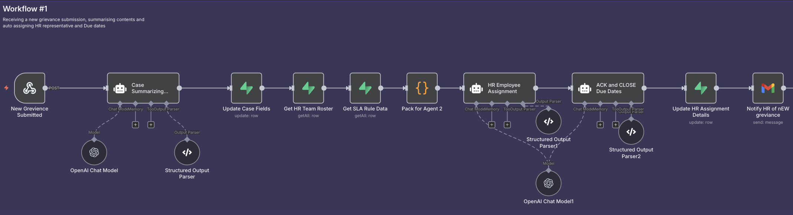

# AI-Powered HR Grievance Management System

**Transforming workplace conflict resolution through intelligent automation and anonymous reporting**

> **Portfolio Project**: End-to-end product management from market research through technical implementation

---

## Problem Statement

25% of UK employees experience workplace conflict annually, costing organizations $359 billion in lost productivity. Traditional grievance processes create bottlenecks, employee distrust, and compliance risks while only 38% of HR leaders have implemented AI solutions.

**Market Opportunity**: $8.79B TAM growing at 7.6% YoY with significant AI adoption gap

---

## Solution Overview

An AI-powered grievance management platform that provides:
- **Anonymous reporting** with secure token-based tracking
- **Intelligent case processing** using GPT-4 for analysis and routing  
- **Real-time communication** preserving anonymity when needed
- **Automated workflows** reducing HR processing time by 70%

### Key Results
- **<2 minutes** initial case processing (vs 2-4 hours manual)
- **100% consistency** in case analysis and routing
- **Real-time transparency** for all stakeholders
- **Complete anonymity protection** with secure communication

---

## Live Demo

🎯 **Try the System**: [Interactive Prototype](https://preview--grievance-management.lovable.app/)
- Username: `admin@test.com` | Password: `123456789`

📊 **Track a Case**: [Status Tracking](https://preview--grievance-management.lovable.app/status)
- Case ID: `GRV-271904563`

---

## Product Documentation

| Document | Purpose | Key Insights |
|----------|---------|--------------|
| [📊 Market Research](docs/research/problem-scoping-research.md) | Problem validation & market analysis | $8.79B TAM, 7.6% YoY growth, 62% AI adoption gap |
| [📋 Product Requirements](docs/product/product-requirements-document.md) | Feature specifications & roadmap | 4 core features, 3-phase development plan |
| [⚙️ Technical Implementation](docs/technical/automation-workflows.md) | AI workflow documentation | 3 intelligent agents, deterministic rules engine |

---

## System Architecture

```
Employee Portal → AI Analysis → Smart Routing → HR Assignment → Real-time Tracking
     ↓              ↓              ↓              ↓              ↓
  Anonymous      GPT-4 Case     Workload      Automated      Status Updates
  Reporting      Processing     Balancing     Notifications   & Communication
```

**Technology Stack**: React + Supabase + n8n + OpenAI GPT-4

---

## Core Features

### 1. Anonymous Grievance Submission


- **6-step guided process** with progress tracking
- **Anonymity options** with secure token generation
- **Category-based routing** for efficient processing

### 2. AI-Powered Case Analysis  


- **Intelligent summarization** extracting WHO/WHAT/WHEN/WHERE
- **Severity assessment** using deterministic keyword rules
- **Automatic categorization** and tagging for consistency

### 3. Smart HR Assignment



- **Expertise matching** based on case category and specialist skills
- **Workload balancing** across available HR representatives
- **Escalation handling** for high-severity cases

### 4. Real-time Case Tracking


- **Progress visualization** with completion percentages
- **Status timeline** showing all case activities  
- **Secure communication** preserving anonymity when required

---

## Product Management Approach

### Research-Driven Development
- **Market analysis** with TAM/SAM sizing and competitive landscape
- **User persona development** based on behavioral research
- **Pain point validation** through industry reports and surveys

### User-Centric Design
- **Anonymous-first approach** building employee trust
- **Transparent communication** throughout case lifecycle
- **Mobile-responsive interface** for accessibility

### Technical Strategy
- **AI-powered automation** reducing manual work by 70%
- **Scalable architecture** supporting enterprise deployment
- **Security-first design** with end-to-end encryption

### Success Metrics
- **Processing time**: <2 minutes (from 2-4 hours)
- **Employee satisfaction**: Anonymous submission increase 40-60%
- **HR efficiency**: 70% reduction in administrative workload
- **Compliance**: 100% audit trail completeness

---

## Implementation Timeline

| Phase | Scope | Status |
|-------|-------|--------|
| **Phase 1** | Core platform with AI workflows | ✅ **Completed** |
| **Phase 2** | Advanced analytics and mobile app | 📅 **Planned Q4 2025** |
| **Phase 3** | Enterprise integrations and SSO | 📅 **Planned Q1 2026** |

---

## Skills Demonstrated

**Product Management**:
- Market research and competitive analysis
- User story development and prioritization  
- Technical requirements specification
- Stakeholder communication and documentation

**Technical Leadership**:
- AI/ML integration strategy
- Workflow automation design
- Database architecture and security
- API design and system integration

**Business Strategy**:
- ROI analysis and success metrics
- Go-to-market planning  
- Risk assessment and mitigation
- Scalability and growth planning

---

## Next Steps & Contact

**For Hiring Managers**: This project demonstrates end-to-end product management from market research through technical implementation and user validation.

**For Technical Review**: The system is built with production-ready architecture using modern web technologies and AI integration.

**For Business Stakeholders**: Clear ROI demonstration with measurable impact on operational efficiency and employee satisfaction.

---

## Repository Structure

```
├── docs/
│   ├── research/           # Market analysis and problem validation
│   ├── product/            # Requirements and specifications  
│   ├── technical/          # Implementation and architecture
│   └── assets/             # Screenshots and diagrams
├── prototype/              # Demo links and setup instructions
└── README.md              # This overview document
```

---

*Last updated: September 2025 | [View Live Demo](https://preview--grievance-management.lovable.app/)*
