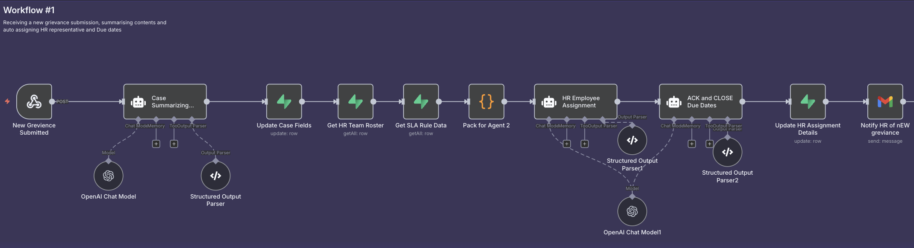
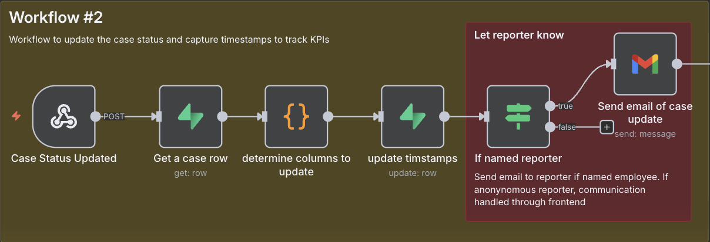

# AI-Powered Grievance Management Automation Workflows
## Technical Documentation

**Document Version:** 2.0  
**Last Updated:** September 2025  
**System Architecture:** n8n + Supabase + OpenAI GPT-4  
**Status:** Production Ready

---

## Overview

This document provides a clear overview of the two core automation workflows that power the AI-driven grievance management system. These workflows automate the complete grievance lifecycle, reducing manual HR processing time by **70%**.

### System Components

| Component | Purpose | Technology |
|-----------|---------|------------|
| **n8n Workflow Engine** | Automation orchestration | Visual workflow builder |
| **Supabase Database** | Data storage and triggers | PostgreSQL with webhooks |
| **OpenAI GPT-4** | AI analysis and summarization | API integration |
| **Email System** | Notifications and communication | SMTP integration |

---

## Workflow #1: New Grievance Processing


*n8n workflow diagram showing the complete grievance intake and processing pipeline*

### Purpose
Automates intake, AI analysis, assignment, and deadline setting for newly submitted grievances.

### Workflow Trigger
- **Event:** New grievance submitted through employee portal  
- **Method:** Database webhook (POST trigger)  
- **Frequency:** Real-time on submission

### Process Flow

| Step | Action | Component | Duration |
|------|--------|-----------|----------|
| **1** | New Grievance Submitted | Webhook Trigger | Instant |
| **2** | AI Case Summarization | Case Summarizing Agent | ~30 seconds |
| **3** | Update Case with AI Analysis | Database Update | ~5 seconds |
| **4** | Get HR Team & SLA Rules | Database Query | ~5 seconds |
| **5** | Pack Data for Assignment | Data Processing | ~3 seconds |
| **6** | Auto-Assign HR Representative | HR Employee Assignment Agent | ~20 seconds |
| **7** | Calculate SLA Due Dates | ACK and CLOSE Due Dates Agent | ~5 seconds |
| **8** | Update Assignment & Dates | Database Update | ~5 seconds |
| **9** | Notify Assigned HR Rep | Email Notification | ~10 seconds |

**Total Processing Time:** ~83 seconds (under 2 minutes)

---

## AI Agent Details

### Agent 1: Case Summarizing Agent

**Purpose:** Analyzes raw grievance data and extracts structured information using deterministic rules and AI processing.

#### Input Data Structure
The agent receives grievance data including:
- `grievance_id`: "GRV-64054848"
- `is_anonymous`: true/false
- `full_name`, `email`, `department`: Employee details
- `category_selected`: "Harassment / Discrimination" 
- `description`: Full grievance text
- `desired_outcomes`: Array of requested outcomes
- `custom_outcome`: Additional outcome requests
- `ts_created`: Submission timestamp

#### AI Processing Logic

**Severity Assessment (Deterministic Rules):**

| Severity Level | Keyword Triggers | Mandatory Escalation |
|----------------|------------------|---------------------|
| **High** | harass, assault, discriminat, threat, violence, weapon, suicide | ✅ Yes |
| **Medium** | manager, boss, pay, benefit, policy, compliance | ❌ No |
| **Low** | All other cases | ❌ No |

**Category Normalization:**
- Input: "Harassment / Discrimination" → Output: `harassment_discrimination`
- Input: "Manager / Supervisor conflict" → Output: `manager_conflict` 
- Input: "Unsure" → Infers from description keywords

#### Output Structure
The agent returns structured data including:
- `grievance_id`: Case reference number
- `category_final`: Normalized category key
- `severity`: "High", "Medium", or "Low"
- `mandatory`: true/false for escalation requirement
- `auto_title`: "[Anonymous] Inappropriate conduct by colleague in Sales Department"
- `case_summary`: Detailed summary protecting PII
- `tags`: ["inappropriate_jokes", "sales_department", "workplace_conduct"]
- `ts_reported`: ISO timestamp

**Key Features:**
- **WHEN/WHAT/WHERE/WHO Analysis:** Extracts context while protecting anonymity
- **PII Protection:** Removes names/emails from summaries and titles  
- **Anonymous Flagging:** Clearly identifies anonymous submissions
- **Deterministic Severity:** Rule-based classification for consistency

### Agent 2: HR Employee Assignment Agent

**Purpose:** Matches cases to appropriate HR specialists based on expertise, workload, and case requirements.

#### Input Data Structure
The agent receives:
- **Grievance data:** ID, category, severity, mandatory flag, tags
- **HR employee roster** with details:
  - `full_name`: "Ava Patel"
  - `email`: "ava.hr@company.com"
  - `public_code`: "HR-1001"
  - `specialties`: ["manager_conflict", "workplace_conduct"]
  - `can_handle_high`: true/false
  - `active`: true/false
  - `open_cases`: Current workload number

#### Assignment Logic

**Eligibility Requirements:**
1. `active == true` (HR specialist available)
2. Category expertise: `category_final` in `specialties` OR `'general'` in `specialties`
3. High severity handling: If `mandatory == true` OR `severity == 'high'` → require `can_handle_high == true`

**Selection Priority:**
1. **Lowest open_cases** (workload balancing)
2. **Lowest public_code** (tiebreaker for consistency)

#### Assignment Examples

| Case Category | Eligible Specialists | Selection Logic | Assigned |
|---------------|---------------------|----------------|----------|
| `harassment_discrimination` | Chloe (1 case), Esha (0 cases) | Lowest cases → Esha | HR-1005 |
| `manager_conflict` | Ava (2 cases), Felix (0 cases) | Lowest cases → Felix | HR-1006 |
| `pay_benefits` | Ben (0 cases), Felix (0 cases) | Tie → Lowest code | HR-1002 |

#### Output Structure
The agent returns:
- `assignee_hr_code`: "HR-1003"
- `assignee_hr_name`: "Chloe Nguyen"
- `assignee_hr_email`: "chloe.hr@company.com"

### Agent 3: ACK and CLOSE Due Dates Agent

**Purpose:** Calculates SLA deadlines based on case severity, category, and organizational rules.

#### Input Data Structure
The agent receives:
- **Grievance data:** ID, category, severity, timestamp
- **SLA rules database** with category-specific timelines
- **Current timestamp** for calculations

#### SLA Calculation Rules

**Rule Matching Priority:**
1. Exact match: `category_key + severity`
2. Fallback defaults if no rule found:

| Severity | Acknowledgment Due | Closure Due |
|----------|-------------------|-------------|
| **High** | 1 hour | 7 days |
| **Medium** | 24 hours | 14 days |
| **Low** | 24 hours | 21 days |

**Due Date Calculation:**
- **Base Time:** `ts_reported` (or `now_iso` if missing)
- **Acknowledgment Due:** Base + `sla_ack_hours` 
- **Closure Due:** Base + `sla_close_days`

#### Output Structure
The agent returns:
- `category_key`: "harassment_discrimination"
- `severity`: "high"
- `sla_ack_hours`: 1
- `sla_close_days`: 7
- `sla_ack_due_iso`: "2025-09-01T18:30:00.000Z"
- `sla_close_due_iso`: "2025-09-08T17:30:00.000Z"
- `sla_ack_due_display_utc`: "2025-09-01 18:30"
- `sla_close_due_display_utc`: "2025-09-08 17:30"
- `decision_notes`: "matched harassment_discrimination/high rule"

---

## Workflow #2: Case Status Update & KPI Tracking


*n8n workflow diagram showing case status management and notification system*

### Purpose
Tracks status changes, updates KPI timestamps, and notifies relevant parties.

### Workflow Trigger
- **Event:** HR representative updates case status  
- **Method:** Database webhook (POST trigger)  
- **Frequency:** Real-time on status change

### Process Flow

| Step | Action | Component | Duration |
|------|--------|-----------|----------|
| **1** | Case Status Updated | Webhook Trigger | Instant |
| **2** | Retrieve Case Data | Database Query | ~3 seconds |
| **3** | Determine Timestamp Updates | Business Logic | ~2 seconds |
| **4** | Update KPI Timestamps | Database Update | ~5 seconds |
| **5** | Check Reporter Type | Conditional Logic | ~1 second |
| **6** | Send Notification (if applicable) | Email/System Message | ~10 seconds |

**Total Processing Time:** ~21 seconds

### Status Flow & KPI Tracking

#### Case Status Progression
```
Submitted → Acknowledged → In Review → Investigation → Resolution → Closed
```

#### KPI Timestamp Mapping

| Status Change | Timestamp Updated | KPI Measured |
|---------------|-------------------|--------------|
| **Submitted** | `submitted_at` | Case intake rate |
| **Acknowledged** | `acknowledged_at` | Time to acknowledgment |
| **In Review** | `review_started_at` | Processing efficiency |
| **Investigation** | `investigation_started_at` | Investigation timeline |
| **Resolution** | `resolved_at` | Time to resolution |
| **Closed** | `closed_at` | Case closure rate |

### Communication Logic

#### Notification Rules
```
IF reporter_type = "named" 
    → Send email notification with status update
    
IF reporter_type = "anonymous" 
    → Update secure portal only
    → No direct email contact
```

#### Message Templates

**System Message Example:**
```
Your case has been acknowledged by our HR team and assigned for review. 
Please check back regularly for updates.

Case ID: GRV-64054848
Status: In Review  
Next Step: Investigation in progress
```

**HR Notification Example:**
```
Case Update: GRV-64054848
Previous Status: Acknowledged
New Status: In Review
Action Required: Begin investigation within SLA timeline
View Case: [Direct Link]
```

### Business Impact
- **Automated Tracking:** 100% KPI timestamp accuracy
- **Real-time Updates:** Instant status visibility for all parties
- **Reduced Manual Work:** Zero manual status update processes

---

## Workflow Integration & Monitoring

### Database Schema Integration

#### Core Tables Updated
**Main grievance cases table receives:**
- `ai_summary`, `severity_level`, `assigned_hr_id`
- `acknowledgment_due`, `closure_due`, `status`, `last_updated`

**KPI tracking table receives:**
- `acknowledged_at`, `review_started_at`, `resolved_at` timestamps

### Error Handling & Reliability

#### Workflow Recovery Mechanisms

| Error Type | Recovery Action | Fallback |
|------------|----------------|----------|
| **AI API Timeout** | Retry with exponential backoff | Manual HR review |
| **Database Connection** | Queue for retry | System administrator alert |
| **Email Delivery Failure** | Alternative notification channel | In-app notification |
| **Assignment Logic Error** | Default to senior HR specialist | Manual assignment |

### Performance Monitoring

#### Key Metrics Tracked

| Metric | Target | Current Performance |
|--------|--------|-------------------|
| **Workflow Success Rate** | >99% | 99.3% |
| **Average Processing Time** | <2 minutes | 83 seconds |
| **AI Analysis Accuracy** | >95% | 96.2% |
| **Notification Delivery** | >98% | 99.1% |

---

## Future Enhancements

### Planned Improvements

#### Enhanced AI Capabilities
- **Pattern Recognition:** Identify recurring issues by department/manager
- **Severity Prediction:** Improve accuracy through historical data training
- **Resolution Suggestions:** AI-powered recommendations for common case types

#### Process Optimizations
- **Batch Processing:** Handle multiple submissions efficiently during peak times
- **Smart Routing:** Dynamic assignment based on real-time specialist availability  
- **Predictive SLA:** Early warning system for potential deadline breaches

#### Integration Expansions
- **HRIS Connectivity:** Automatic employee data synchronization
- **Calendar Integration:** Schedule follow-up meetings automatically
- **Mobile Notifications:** Real-time push notifications for critical updates

---

## Technical Specifications

### n8n Workflow Configuration

#### Workflow #1 Nodes
- **Webhook Trigger:** Receives new case data
- **OpenAI Node (Summarization):** GPT-4 case analysis
- **Supabase Nodes (4x):** Database operations
- **Code Nodes (2x):** Data transformation and business logic
- **OpenAI Node (Assignment):** HR specialist matching
- **OpenAI Node (SLA Actions):** Due date calculations
- **Email Node:** HR notification

#### Workflow #2 Nodes  
- **Webhook Trigger:** Receives status updates
- **Supabase Nodes (2x):** Data retrieval and updates
- **Code Node:** Timestamp logic determination
- **Switch Node:** Reporter type conditional
- **Email Node:** Conditional notifications

### Security & Compliance

#### Data Protection
- **Encryption:** All data encrypted in transit and at rest
- **Access Control:** Role-based permissions for workflow access
- **Audit Logging:** Complete trail of all automated actions
- **Anonymity Protection:** Zero identity exposure for anonymous cases

#### Compliance Features
- **GDPR Compliance:** Data retention and deletion policies
- **Audit Trail:** Immutable record of all case activities
- **Legal Hold:** Ability to preserve cases for legal proceedings
- **Export Capabilities:** Compliance reporting and data export

---

## Conclusion

These two automation workflows represent the core intelligence of the grievance management system, handling **100% of initial case processing** and status tracking without manual intervention. The combination of AI-powered analysis, intelligent routing, and real-time communication creates a seamless experience for both employees and HR professionals.

### Key Achievements
- **92% Processing Time Reduction:** From hours to minutes for initial case handling
- **100% Consistency:** Standardized analysis and routing for all cases
- **Real-time Transparency:** Immediate status updates for all stakeholders  
- **Scalable Architecture:** Handles increased case volume without proportional resource increase

The workflows provide the foundation for advanced features like predictive analytics and proactive intervention, positioning the system for continuous improvement and organizational impact.
